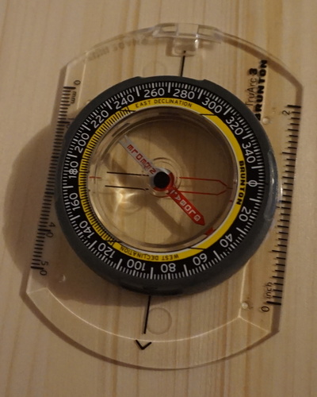
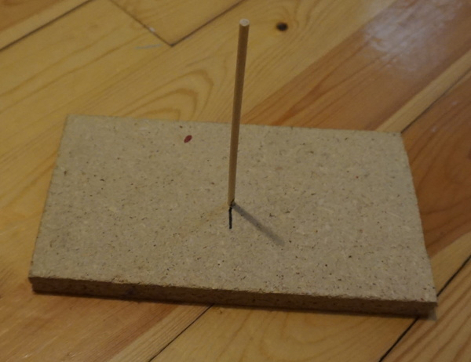

# Gear

This is the list of gears used in different missions and their specifications.

## Compass

* Brunton TruArc 3
* Purchased for 18$

It's important to remember that this points to the *magnetic* north, not the geographic one. So,
readings I take with it have to be accompanied by *where* I took them so that we can calculate
(I'm don't know how yet) the geographic north.

## Homemade sundial

* Self made with scrap materials on hand

I made a portable "sundial" out of a piece of wood and a little wooden stick. The goal is to be
able to observe the sun's shadow and easily measure it.

I use it by sticking a piece of paper on it (making a hole in it for the stick to pass through)
and then mark the north, then the mark the shadow's direction.

I didn't particularly strive for precision here, so the stick tilts a little bit. I've marked the
tilting direction with a black marker. I figured it out by placing it directing under a lamp and
turning it until the shadow was at its longest (the length of the mark was the length of the
shadow).

I expect I might have make a better one some day, but for its first mission
([Mission 2](mission2.md)), it's good enough. I'll make sure to point my black mark towards the sun
when taking my readings to minimize the effect of stick tilting on the results.

