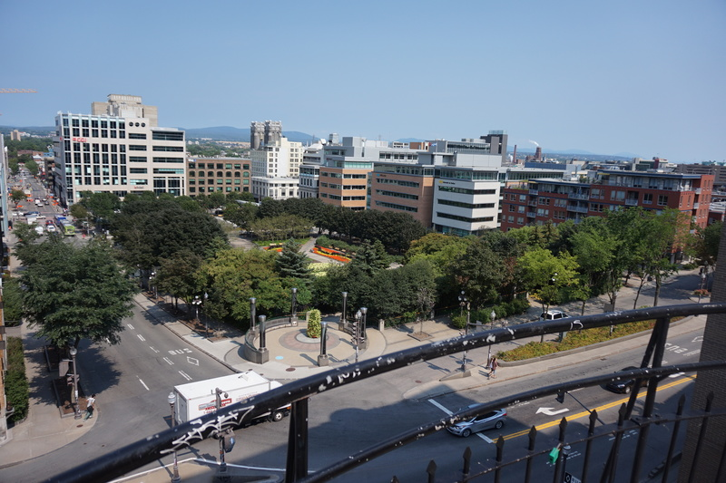
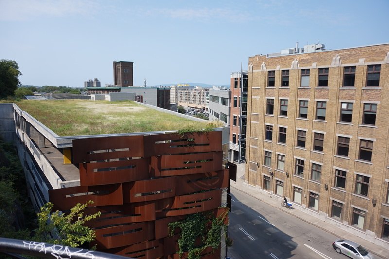
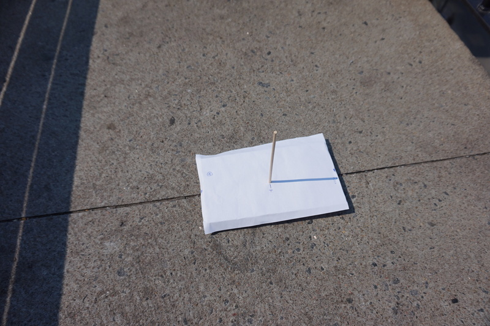

# Mission 2a: Where is my North?

[Mission 2](mission2.md) didn't work out because I couldn't rely on compass readings in an urban
settings, setting I can't easily get out of these days. I'm trying an alternative method of getting
a reference direction to compare my sundial shadow readings against so that I can predict the
sun's position at dusk and dawn.

## Method

Similarly to what has to be done for [Mission 1](mission1.md), I will find the north by patiently
waiting for the sun to reach its zenith. I'll know it does by observing that the length of the
stick shadow is the shortest it's been that day. With this, I'll have the geographical north.

For this to work, I'll need to always use the same observation spot whenever I want to use
"my north" because I'll have to align myself to something, a feature in the observation spot.

### Gear

* [Homemade sundial](gear.md#homemade-sundial)
* Watch
* Camera

## Experiment planning

1. Find a good observation spot for [Mission 2](mission2.md)'s successor.
1. Go there 30 minutes before noon.
1. Find a feature of the spot I can reliably align myself to at each observation.
1. Put a blank sheet on the sundial.
1. Align the sundial to that feature and mark the position of the feature on the sheet.
1. Every 5 minutes or so, mark the position of the tip of the shadow produced by the stick.
1. With each reading, the length of the shadow should decrease, and at some point, start to
   increase.
1. The experiment is over when our readings are clearly on an increasing trend.

### Observation spot

I've already identified Ste-Claire's street stairs (in Quebec city of course) as a good observation
spot. There are a lot of high buildings nearby, but they don't block the sun at dusk and dawn (at
least at this time of the year) and unlike other vantage points nearby, there aren't any trees
messing my observations with their shadows.

There's a half circle observation stage over the stairs which is a pretty nice spot and,
conveniently, the half circle is made of two concrete slabs, clearly separated by a stright line.
I'll use that line as my reference feature.

### Sundial innacuracies

I've made a tentative reading session on 2015-08-19 but it turns out that the stick moves too
much, readings are inconsistent (for example, 12:00 was shorter than 12:05, but 12:10 was *also*
shorter than 12:05...). I'll have to glue the stick in to ensure that it doesn't move between
readings.

The main piece of wood is also not totally flat, so it wobbles on the ground when pressured is
applied at the edges. During my tentative, I've identified a spot on my sheet and I awlays applied
pressure on the same spot during my readings, making them more consistent. I should to the same
thing next time.

### Expected results

When the experiment is over, I can draw a line from the sheet's stick hole to the closest mark.
That will be "my north". It will indicate the north everytime the sheet is properly placed
relatively to my chosen feature (the line between the two concrete slabs). If I copy the contents
of that sheet on decal paper, I'll have a handy way of indicating the north in all my following
readings.
